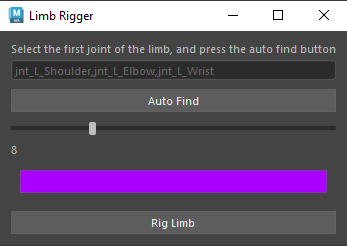

# My Maya Plugins

## Limb Rigger



[Limb Rigger]("./src/LimbRigger.py")
This  plugin rigs any 3 joint limb with ik and fk and ikfk belnd.

* Support auto joint finding
* Controller size control
* Controller color control

## Proxy Generator

[Proxy Generator]("./src/ProxyGenerator.py")
This plugin selects all skin/mesh that is binded to the joint selected and breaks it down into smaller chunks.


### Mesh Finder
```python
    def BuildProxyForSelectedMesh(self):
        model = mc.ls(sl=True)[0]
        if not IsMesh(model):
            print(f"{model} is not a mesh!")
            return
        
        self.model = model
        modelShape = mc.listRelatives(self.model,s=True)[0]
        skin = GetAllConnectionsIn(modelShape, GetUpperStream, IsSkin)
        if not skin:
            print(f"{self.model} is not bound!")
            return
        
        jnts = GetAllConnectionsIn(modelShape, GetUpperStream, IsJoint)
        if not jnts:
            print(f"{self.model} is not bound with any joint!")
            return
        
        self.skin = skin[0]
        self.jnts = jnts
        print(f"found model {self.model} with skin {self.skin} and joints: {self.jnts}")

        jntVertDict = self.GenerateJntVertsDict()
        chunks = []
        ctrls = []
        for jnt, verts in jntVertDict.items():
            newChunk = self.CreateProxyModelForJntAndVerts(jnt, verts)
```
This function checks to see if what you selected is a mesh. Then it checks if your mesh is a skin and bound to a skeleton. If something is wrong, it'll send the error message that corresponds to what error is happening.

### Proxy Model for Joints and Verts
```python
    def CreateProxyModelForJntAndVerts(self, jnt, verts):
        if not verts:
            return None
        
        faces = mc.polyListComponentConversion(verts, fromVertex=True, toFace=True)
        faces = mc.ls(faces, fl=True)

        faceNames = set()
        for face in faces:
            faceNames.add(face.replace(self.model, ""))

        dup = mc.duplicate(self.model)[0]
        allDupFaces = mc.ls(f"{dup}.f[*]", fl=True)
        facesToDelete = []
        for dupFace in allDupFaces:
            if dupFace.replace(dup, "") not in faceNames:
                facesToDelete.append(dupFace)

        mc.delete(facesToDelete)

        dupName = self.model + "_" + jnt + "_proxy"
        mc.rename(dup, dupName)
        return dupName
```
This function will create a duplication of the model and only keep the vertices and faces that are selected and delete all the rest.

### Generate Joint/Vert Dictionary
```python
    def GenerateJntVertsDict(self):
        dict = {}
        for jnt in self.jnts:
            dict[jnt] = []

        verts = mc.ls(f"{self.model}.vtx[*]", fl=True)
        for vert in verts:
            owningJnt = self.GetJntWithMaxInfluence(vert, self.skin)
            dict[owningJnt].append(vert)
```
This function will create a dictionary of all the verts and joints that have been selected.

### Getting Joints with Max Influence
```python
    def GetJntWithMaxInfluence(self, vert, skin):
        weights = mc.skinPercent(skin, vert, q=True, v=True)
        jnts = mc.skinPercent(skin, vert, q=True, t=None)

        maxWeightIndex = 0
        maxWeight = weights[0]
        for i in range(1, len(weights)):
            if weights[i] > maxWeight:
                maxWeight = weights[i]
                maxWeightIndex = i

        return jnts[maxWeightIndex]
```
This function will select all the surrounding verts and faces based on the influence the skeleton has on the mesh. It mainly selects those with the highest influence.

### Proxy Generator Window
```python
class ProxyGeneratorWidget(MayaWindow):
    def __init__(self):
        super().__init__()
        self.generator = ProxyGenerator()
        self.masterLayout = QVBoxLayout()
        self.setLayout(self.masterLayout)

        self.masterLayout.addWidget(QLabel("Please select the rigged model, and press the build button"))
        buildBtn = QPushButton("Build")
        self.masterLayout.addWidget(buildBtn)
        buildBtn.clicked.connect(self.generator.BuildProxyForSelectedMesh)
        self.setWindowTitle("Proxy Generator")

    def GetWidgetUniqueName(self):
        return "ProxyGeneratorER4152025212"
```
This class creates the Proxy Generator pop-up window in Maya so the user can access and use the tool.