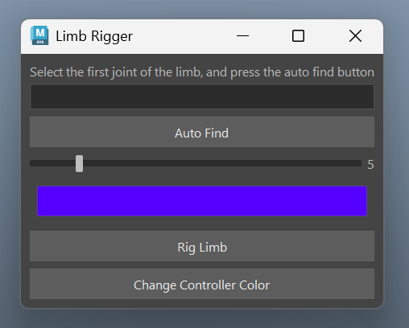

# My Maya Plugins

## Limb Rigger

[Limb Rigger]("./src/LimbRigger.py")
This  plugin rigs any 3 joint limb with ik and fk and ikfk belnd.

* Support auto joint finding
* Controller size control
* Controller color control

[Proxy Generator]("./src/ProxyGenerator.py")
This plugin selects all skin/mesh that is binded to the joint selected.